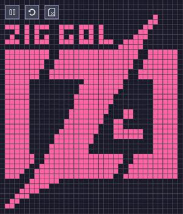

# zig-gol (Game of Life in Zig)
This is a simple implementation of Conway's game of life using Raylib bindings in Zig.

## Current features
- Pan, zoom, camera clamp
- Pause sim
- Clear and randomize cells
- Draw cells
## Planned features
- Screen resize/fps change
- Pretty colors
- Rules menu (neighborhoods, dead/alive rules, edge looping)
